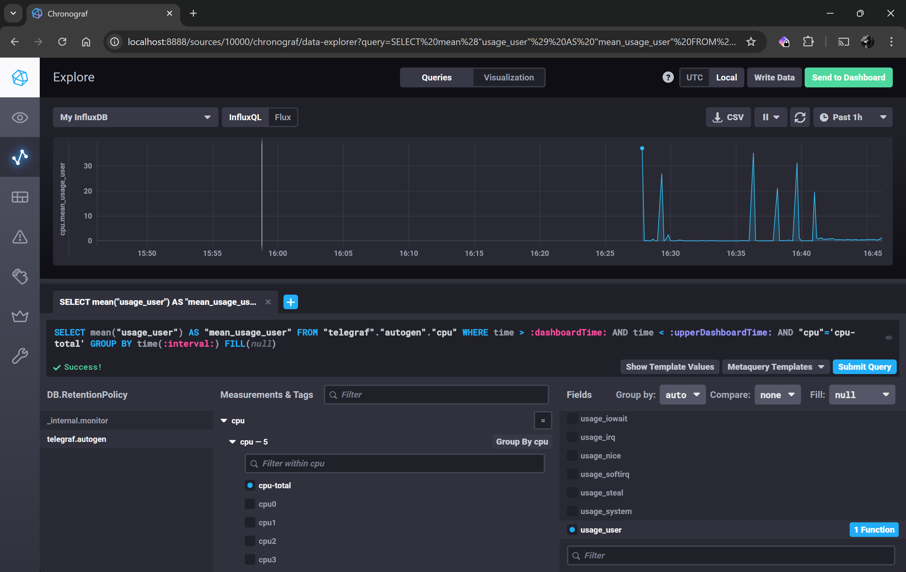
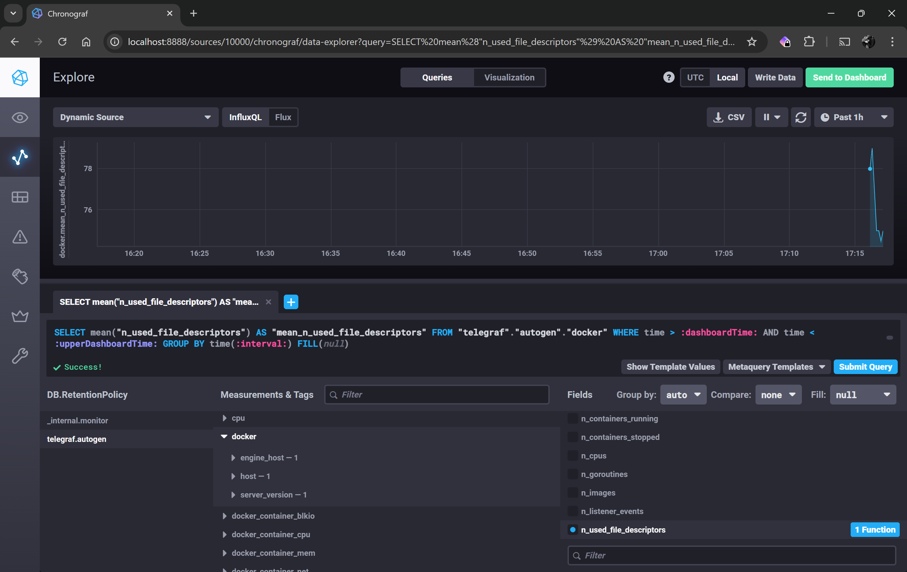

# Домашнее задание к занятию "13.Системы мониторинга"

## Обязательные задания

1. Вас пригласили настроить мониторинг на проект. На онбординге вам рассказали, что проект представляет из себя 
платформу для вычислений с выдачей текстовых отчетов, которые сохраняются на диск. Взаимодействие с платформой 
осуществляется по протоколу http. Также вам отметили, что вычисления загружают ЦПУ. Какой минимальный набор метрик вы
выведите в мониторинг и почему?

### Ответ.

Я бы предложил следующий набор метрик, исходя из описания задачи:

- CPU Load (CPU usage, load average) - контролировать загрузку процессоров и ядер, чтобы предотвратить деградацию производительности.
- RAM usage - контролировать нехватку ОЗУ и возможные утечки памяти.
- Disk usage - контролировать достаточность дискового пространства.
- Inodes - контролировать количество свободных inodes, чтобы избежать ошибок сохранения отчётов.
- IOPS (Input/Output Operations per Second) - контролировать нагрузку на дисковую подсистему.
- Disk latency - контролировать задержки на чтение/запись, т.к. высокие значения могут привести к ухутшению производительности и увеличению времени отклика.
- HTTP metrics - контролировать работоспособность HTTP-сервиса, количество запросов, процент ошибок, латентность.
- Network usage (throughput, errors, drops) - отслеживать пропускную способность сети (входящий и исходящий трафик). Недостаточная пропускная способность сетевого интерфеса, ошибки или дропы пакетов могут негативно влиять на доставку отчётов.

#
2. Менеджер продукта посмотрев на ваши метрики сказал, что ему непонятно что такое RAM/inodes/CPUla. Также он сказал, 
что хочет понимать, насколько мы выполняем свои обязанности перед клиентами и какое качество обслуживания. Что вы 
можете ему предложить?

### Ответ.

Я бы предложил следующее:

Построить Dashboard, где будет визуально показано выполнение целевых показателей сервиса, которые необходимы менеджеру продукта, например:

Показатели "Service Level Indicator":

- Доступность сервиса - платформа была доступна для клиентов такой-то процент времени за период.
- Процент успешных операций - сколько запросов из общего количества завершились успешно за период, например - 2xx коды.
- Среднее время ответа - средний отклик платформы составляет столько-то секунд.
- Количество сгенерированных отчётов - система обрабатывает столько-то задач за период.

Показатели "Service Level Objective":

- Сервис был доступен 99.9% за указанный период.
- Процент успешных операций должен быть не ниже 99% в месяц.
- Среднее время ответа должно быть не более 150 мс.
- Количество сгенерированных отчётов должно быть не ниже 99%.

Показатели "Service Level Agreement":

- Сервис был доступен 99% за указанный период.
- Процент успешных операций должен быть не ниже 95% в месяц.
- Среднее время ответа должно быть не более 2000 мс.
- Количество сгенерированных отчётов должно быть не ниже 95%.

Исходя из показателей SLO и SLA менеджер продукта будет видеть достигает ли команда указанных показателей SLO, SLA и соблюдаются ли обязательства перед клиентом.

#
3. Вашей DevOps команде в этом году не выделили финансирование на построение системы сбора логов. Разработчики в свою 
очередь хотят видеть все ошибки, которые выдают их приложения. Какое решение вы можете предпринять в этой ситуации, 
чтобы разработчики получали ошибки приложения?

### Ответ.

Написание скрипта, который будет выполнять поиск ошибок в логах и отправлять их на email разработчикам.

#
4. Вы, как опытный SRE, сделали мониторинг, куда вывели отображения выполнения SLA=99% по http кодам ответов. 
Вычисляете этот параметр по следующей формуле: summ_2xx_requests/summ_all_requests. Данный параметр не поднимается выше 
70%, но при этом в вашей системе нет кодов ответа 5xx и 4xx. Где у вас ошибка?

### Ответ

Возможно в систему попадают коды редиректов 3xx или веб-сервер отдаёт 1xx статусы. Они учитываются в summ_all_requests, но не входят в summ_2xx_requests. Поэтому процент успешных запросов 2xx падает.

Если неоходимо расчитать процент всех успешных кодов ответов 1xxx, 2xx и 3xx, то необходимо изменить формулу следующим образом:

```
(summ_2xx_requests + summ_1xx_requests + summ_3xx_requests) / summ_all_requests
```

Если необходимо учитывать только коды 2xx, то формула будет следующая:

```
summ_2xx_requests / (summ_all_requests - summ_1xx_requests - summ_3xx_requests)
```

#
5. Опишите основные плюсы и минусы pull и push систем мониторинга.

### Ответ.

Pull-система мониторинга.

Плюсы:

- Централизованное управление: легко управлять когда и какие источники опрашивать.
- Гибкость настройки интервалов: возможность индивидуально настраивать частоту опроса для разных источников данных.
- Безопасность: не нужно открывать агентам доступ внуть периметра безопасности, соблюдается правило когда запрос должен идти из более защищенного контура данных в менее защищенный.

Минусы:

- Масштабирование: при большом количестве агентов нагрузка на центральный сервер может резко возрасти.
- Диинамические окружения: сложно опрашивать динамически создаваемые сущности, например, в Kubernetes.
- Ограничение получения событий: сложность реалиализации быстрой доставки метрик, опрос всегда происходит с задержкой.


Push-система мониторинга.

Плюсы:

- Динамические среды: новые агенты сразу начинают передавать данные без необходимости их централизованной настройки.
- Масштабируемость: нагрузка распределяется по агентам или агрегируются на прокси-серверах, центральный сервер принимает данные агентов и или прокси в режиме потока.
- Низкая задержка: агенты могут отправлять данные немедленно после события.
- Гибкость: можно отправлять данные в разные системы мониторинга или промежуточные прокси-серверы.

Минусы:

- Сложность управления: необходимо управлять настройками агентов на каждом узле.
- Безопасность: необходимость настройки сетевого доступа для агентов для доступа к центральным серверам, например, через из интернет или DMZ. Т.е. не соблюдается правило обращения из более безопасного периметра в менее защищенный.
- Потеря данных: в случае поломки агента или потери связи, данные могут не быть получены или получены частично.

#
6. Какие из ниже перечисленных систем относятся к push модели, а какие к pull? А может есть гибридные?

    - Prometheus 
    - TICK
    - Zabbix
    - VictoriaMetrics
    - Nagios

### Ответ.

Prometheus.

  Тип: Pull

  Prometheus по умолчанию использует pull-модель, опрашивая экспортеры по HTTP. Есть возможность использовать push через Pushgateway для некоторых случаев.

TICK stack (Telegraf, InfluxDB, Chronograf, Kapacitor).

  Тип: Push

  Telegraf агент собирает метрики и отправляет их в InfluxDB работая в решиже push.

Zabbix.

  Тип: Pull + Push

  Zabbix агенты могут работать как в активном push режиме отправляя данные на сервер, так и в pull, когда сервер их опрашивает.

VictoriaMetrics.

  Тип: Pull + совместимость с Push

  VictoriaMetrics - это TSDB (time series database), которая совместима с Prometheus. Может принимать push из других систем, например, от Prometheus или Telegraf. Также VictoriaMetrics поддерживает Prometheus scraping API, позволяя напрямую пуллить метрики с экспортёров.

Nagios.

  Тип: Pull + Push

  Nagios, как и Zabbix с помощью NCPA агента может работать в режиме pull и push.

#
7. Склонируйте себе [репозиторий](https://github.com/influxdata/sandbox/tree/master) и запустите TICK-стэк, 
используя технологии docker и docker-compose.

В виде решения на это упражнение приведите скриншот веб-интерфейса ПО chronograf (`http://localhost:8888`). 

P.S.: если при запуске некоторые контейнеры будут падать с ошибкой - проставьте им режим `Z`, например
`./data:/var/lib:Z`

### Ответ.


#
8. Перейдите в веб-интерфейс Chronograf (http://localhost:8888) и откройте вкладку Data explorer.
        
    - Нажмите на кнопку Add a query
    - Изучите вывод интерфейса и выберите БД telegraf.autogen
    - В `measurments` выберите cpu->host->telegraf-getting-started, а в `fields` выберите usage_system. Внизу появится график утилизации cpu.
    - Вверху вы можете увидеть запрос, аналогичный SQL-синтаксису. Поэкспериментируйте с запросом, попробуйте изменить группировку и интервал наблюдений.

Для выполнения задания приведите скриншот с отображением метрик утилизации cpu из веб-интерфейса.

### Ответ.



#
9. Изучите список [telegraf inputs](https://github.com/influxdata/telegraf/tree/master/plugins/inputs). 
Добавьте в конфигурацию telegraf следующий плагин - [docker](https://github.com/influxdata/telegraf/tree/master/plugins/inputs/docker):
```
[[inputs.docker]]
  endpoint = "unix:///var/run/docker.sock"
```

Дополнительно вам может потребоваться донастройка контейнера telegraf в `docker-compose.yml` дополнительного volume и 
режима privileged:
```
  telegraf:
    image: telegraf:1.4.0
    privileged: true
    volumes:
      - ./etc/telegraf.conf:/etc/telegraf/telegraf.conf:Z
      - /var/run/docker.sock:/var/run/docker.sock:Z
    links:
      - influxdb
    ports:
      - "8092:8092/udp"
      - "8094:8094"
      - "8125:8125/udp"
```

После настройке перезапустите telegraf, обновите веб интерфейс и приведите скриншотом список `measurments` в 
веб-интерфейсе базы telegraf.autogen . Там должны появиться метрики, связанные с docker.

### Ответ.



Факультативно можете изучить какие метрики собирает telegraf после выполнения данного задания.

## Дополнительное задание (со звездочкой*) - необязательно к выполнению

1. Вы устроились на работу в стартап. На данный момент у вас нет возможности развернуть полноценную систему 
мониторинга, и вы решили самостоятельно написать простой python3-скрипт для сбора основных метрик сервера. Вы, как 
опытный системный-администратор, знаете, что системная информация сервера лежит в директории `/proc`. 
Также, вы знаете, что в системе Linux есть  планировщик задач cron, который может запускать задачи по расписанию.

Суммировав все, вы спроектировали приложение, которое:
- является python3 скриптом
- собирает метрики из папки `/proc`
- складывает метрики в файл 'YY-MM-DD-awesome-monitoring.log' в директорию /var/log 
(YY - год, MM - месяц, DD - день)
- каждый сбор метрик складывается в виде json-строки, в виде:
  + timestamp (временная метка, int, unixtimestamp)
  + metric_1 (метрика 1)
  + metric_2 (метрика 2)
  
     ...
     
  + metric_N (метрика N)
  
- сбор метрик происходит каждую 1 минуту по cron-расписанию

Для успешного выполнения задания нужно привести:

а) работающий код python3-скрипта,

б) конфигурацию cron-расписания,

в) пример верно сформированного 'YY-MM-DD-awesome-monitoring.log', имеющий не менее 5 записей,

P.S.: количество собираемых метрик должно быть не менее 4-х.
P.P.S.: по желанию можно себя не ограничивать только сбором метрик из `/proc`.

2. В веб-интерфейсе откройте вкладку `Dashboards`. Попробуйте создать свой dashboard с отображением:

    - утилизации ЦПУ
    - количества использованного RAM
    - утилизации пространства на дисках
    - количество поднятых контейнеров
    - аптайм
    - ...
    - фантазируйте)
    
    ---

### Как оформить ДЗ?

Выполненное домашнее задание пришлите ссылкой на .md-файл в вашем репозитории.

---

